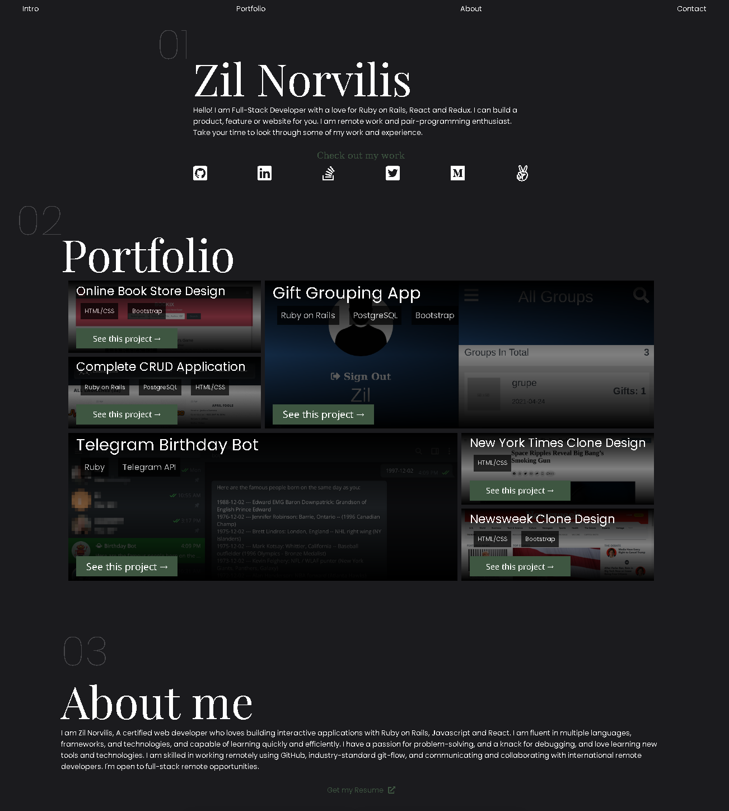

# Personal Portfolio Website

This is my personal portfolio website. Built on HTML, CSS and JavaScript. This was built with responsiveness in mind.

## Built With

- HTML
- CSS
- JavaScript

## Live Demo

[Live Demo Link](https://zilton7.github.io/portfolio/)

### To get a local copy up and running:

1) Clone this repository or download the Zip folder. 
>``git clone https://github.com/zilton7/portfolio.git``

2) Navigate to the location of the folders you have cloned
and drop 'index.html' file into your browser

## Authors

 **Zil Norvilis**

- GitHub: [@zilton7](https://github.com/zilton7)
- Twitter: [@devnor7](https://twitter.com/devnor7)
- LinkedIn: [zil-norvilis](https://www.linkedin.com/in/zil-norvilis)

## Contributing

Contributions, issues, and feature requests are welcome!

## Show your support

Give a ⭐️ if you like this project and how we manage to build it!
